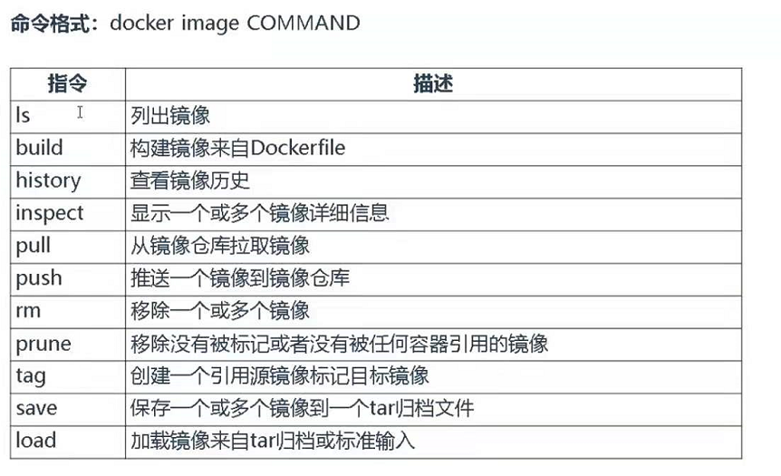
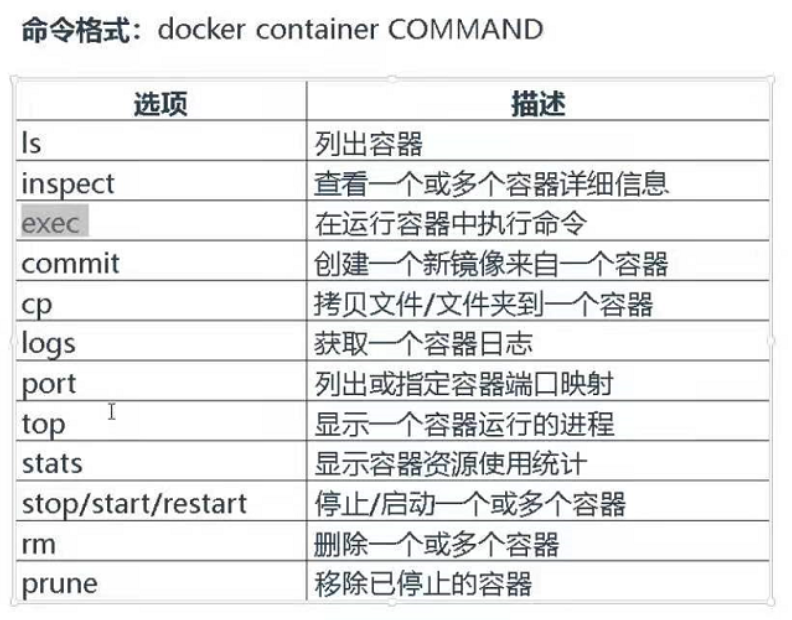
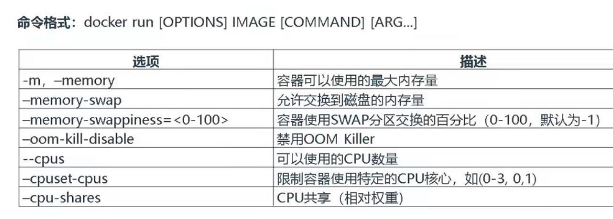
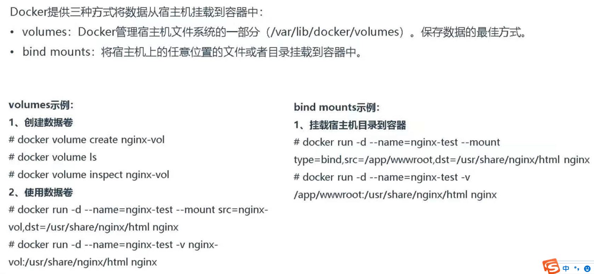

### 一、Docker部署（Centos7）

* 启动：
  `systemctl start docker`

* 停止：
  `systemctl stop docker`

* 重启
  `systemctl restart docker`

* 查看状态
  `systemctl status docker`

* 开机启动
  `systemctl enable docker`

* 查看docker概要信息
  `docker info`

* 查看docker帮助文档
  `docker ‐‐help`

* 查看正在运行容器  
  `docker container ps
  docker container ps -a
  docker container ps -q`

### 二、docker仓库配置

* Docker Hub是由Docker公司负责维护的公共镜像仓库，包含大量的容器镜像，
* Docker工具默认从这个公共镜像库下载镜像。地址: [Docker镜像官网](https://hub.docker.com/)

```dockerfile
配置镜像加速器（没有就新增daemon.json）:
vi /etc/docker/daemon.json
{
    "registry-mirrors": ["https://b9pmyelo.mirror.aliyuncs.com"]
}
systemctl restart docker
```

### 三、镜像命令



1、列出本地镜像

`docker image ls`

-20220117180923-7womurg.png)

2、查看镜像历史（端口等）

`docker image history tomcat`

-20220117180923-mtqrutf.png)

3、显示镜像配置信息

`docker image inspect nginx`

-20220117180923-wh0mv1n.png)

4、判断本地是否存在这个镜像，没有就拉下来

`docker image pull tomcat`

-20220117180923-elaauca.png)

5、移除一个镜像（不被容器应用的）

`docker image rm [imageName]或者[imageId]`

6、打包&导入镜像

`save&load`

==Docker_导出镜像部署==

```dockerfile
1、保存镜像
docker commit -a "ghq" -m "备份镜像重新挂载" d59522711ee3  new-datax-web
docker commit -a "ghq" -m "备份镜像重新挂载" 5c15bc992ffe  new-mysql
2、部署
docker run  -it -d --name new-datax-web -p 9504:9504 -p 9527:9527 -p 9999:9999 -v /usr/docker/datax-web:/usr/local/datax new-datax-web
docker run  -it -d --name new-mysql -p 3306:3306 -v /usr/docker/datax-web-mysql:/var/lib/mysql new-mysql
```

### 四、容器命令



1、列出容器

`docker container ls`

-20220117181327-adffmeu.png)

2、查看容器详细信息

`docker container inspect nginx`

-20220117181327-rr8xbc4.png)

3、运行容器命令&进入容器

方式一

`docker exec -it 9fccf0236619 /bin/bash`

方式二

`docker exec -it [name] bash`

* 退出容器

`exit`

* 宿主机执行容器命令

`docker exec [命令] 等于进入容器执行命令`

* 在容器里面安装编辑工具
  ```dockerfile
  先进去容器里面执行
  １．apt-get update
  ２．apt-get install vim
  ```

4、宿主和容器拷贝文件

```dockerfile
1、Docker容器向宿主机传送文件格式:
docker cp container_id:<docker容器内的路径> <本地保存文件的路径>
比如:
docker cp 10704c9eb7bb:/root/test.text /home/vagrant/test.txt
2、宿主机向Docker容器传送文件格式:
docker cp 本地文件的路径 container_id:<docker容器内的路径>
比如:
docker cp  /home/vagrant/test.txt 10704c9eb7bb:/root/test.text
```

5、获取容器的日志

`docker container logs nginx`

-20220117181416-03rh4su.png)

6、列出容器的端口

`docker container port nginx`

-20220117181416-byii91h.png)

7、容器的进程

`docker container top nginx`

-20220117181416-uswslwg.png)

8、容器资源使用

`docker container stats nginx`

-20220117181416-c8ofuy8.png)

9、启用、停用、重启容器

`docker container start nginx`

`docker container stop nginx`

`docker container restart nginx`

-20220117181416-cry36qg.png)

10、移除容器（停用后才可以移除）

`docker container rm nginx`

-20220117181416-3g5fbwn.png)

### 五、镜像配置启动



### 六、容器配置启动


```dockerfile
docker run -it -d -m 512m --memory-swap 1g --name josh-nginx -p 8080:80  nginx
docker run -it -d -m 512m --memory-swap 1g --name josh-nginx -p 8080:80 -v /josh/:/usr/share/nginx/html nginx
```

* 查看容器
  `1、docker container ps（不包含退出的容器）`
  -20220117181741-8mkhtwr.png)
  `2、docker container ps -a（包含退出的容器）`
  -20220117181741-d1zd7os.png)
  `3、docker container ps -q (不包含退出的容器id)`
  -20220117181741-ytxp81u.png)

### 七、容器数据持久化


