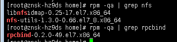
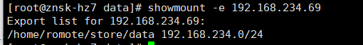

#### 一、NFS服务的安装

1. 查看系统是否已经安装NFS
    

```powershell
rpm -qa | grep nfs
rpm -qa | grep rpcbind
```

2. 安装NFS

```powershell
yum -y install nfs-utils rpcbind
```

#### 二、NFS服务端配置

1. 创建共享目录并设置权限

```powershell
#创建目录
mkdir -p /romote/store/data
#设置权限
chmod 776 /romote/store/data
```

2. 配置编辑export文件（若不存在就自行创建）

```powershell
vim /etc/exports
在export添加上
/data/lys 192.168.2.0/24(rw,no_root_squash,no_all_squash,sync)
```

* export文件内容格式：

```bash
/etc/exports文件内容格式：
<输出目录> [客户端1 选项（访问权限,用户映射,其他）] [客户端2 选项（访问权限,用户映射,其他）]
a. 输出目录：
输出目录是指NFS系统中需要共享给客户机使用的目录；
b. 客户端：
客户端是指网络中可以访问这个NFS输出目录的计算机
客户端常用的指定方式
* 指定ip地址的主机：192.168.0.200
* 指定子网中的所有主机：192.168.0.0/24 192.168.0.0/255.255.255.0
* 指定域名的主机：david.bsmart.cn
* 指定域中的所有主机：*.bsmart.cn
* 所有主机：*
c. 选项：
选项用来设置输出目录的访问权限、用户映射等。
NFS主要有3类选项：
访问权限选项
* 设置输出目录只读：ro
* 设置输出目录读写：rw
用户映射选项
* all_squash：将远程访问的所有普通用户及所属组都映射为匿名用户或用户组（nfsnobody）；
* no_all_squash：与all_squash取反（默认设置）；
* root_squash：将root用户及所属组都映射为匿名用户或用户组（默认设置）；
* no_root_squash：与rootsquash取反；
* anonuid=xxx：将远程访问的所有用户都映射为匿名用户，并指定该用户为本地用户（UID=xxx）；
* anongid=xxx：将远程访问的所有用户组都映射为匿名用户组账户，并指定该匿名用户组账户为本地用户组账户（GID=xxx）；
其它选项
* secure：限制客户端只能从小于1024的tcp/ip端口连接nfs服务器（默认设置）；
* insecure：允许客户端从大于1024的tcp/ip端口连接服务器；
* sync：将数据同步写入内存缓冲区与磁盘中，效率低，但可以保证数据的一致性；
* async：将数据先保存在内存缓冲区中，必要时才写入磁盘；
* wdelay：检查是否有相关的写操作，如果有则将这些写操作一起执行，这样可以提高效率（默认设置）；
* no_wdelay：若有写操作则立即执行，应与sync配合使用；
* subtree：若输出目录是一个子目录，则nfs服务器将检查其父目录的权限(默认设置)；
* no_subtree：即使输出目录是一个子目录，nfs服务器也不检查其父目录的权限，这样可以提高效率；
```

* 配置生效

```bash
exportfs -rv
```

3. 启动&停用rpcbind和nfs服务
    * ==启动==
      `/bin/systemctl start rpcbind.service`
      `/bin/systemctl start nfs.service`
    * ==centos7自动启动nfs配置==
      `/bin/systemctl enable rpcbind`
      `/bin/systemctl enable nfsp`
    * ==停用==
      `/bin/systemctl stop nfs.service`

4. 查看RPC服务的注册状况

```bash
rpcinfo -p localhost
```

5. 服务端使用showmount命令查询NFS的共享状态

```bash
showmount -e localhost
选项与参数：
-a ：显示目前主机与客户端的 NFS 联机分享的状态；
-e ：显示某部主机的 /etc/exports 所分享的目录数据
```


#### 三、客户端配置

1. 检查是否安装了ufs-utils

```bash
rpm -qa | grep nfs-utils
```

2. 安装nfs-utils 客户端

```bash
yum -y install nfs-utils
```

3. 创建挂载目录

```bash
mkdir -p /mount/data
```

4. 查看服务器抛出的共享目录信息

```bash
showmount -e 192.168.234.69
```



5. 为了提高NFS的稳定性，使用的是TCP协议挂载，NFS默认是用UDP协议

```bash
mount -t nfs 192.168.234.69:/home/romote/store/data /mount/data -o proto=tcp -o nolock
```

6. 查看挂载结果

```bash
df -h
```

7. 卸载已经挂载的NFS

```bash
umount /mount/data
```

#### 四、配置NFS服务器端需要关闭防火墙

1. 查看防火墙状态（绿的running表示防火墙开启）：

```bash
systemctl status firewalld.service
```

2. 执行关闭命令：

```bash
systemctl stop firewalld.service
```

3. 再次执行查看防火墙命令：

```bash
systemctl status firewalld.service
```

4. 执行开机禁用防火墙自启命令  ：

```bash
systemctl disable firewalld.service
```
