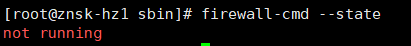
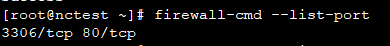
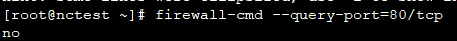
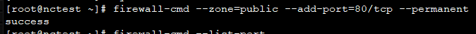

#### 一、Centos7操作

1. Centos默认安装的firewald，如果没有请执行下面命令安装
    ```powershell
    yum install firewalld firewalld-config
    ```

2. 启动防火墙
    ```powershell
    systemctl start firewalld.service
    ```

3. 禁止开机启动防火墙
    ```powershell
    systemctl disable firewalld.service
    ```

4. 关闭防火墙
    ```powershell
    systemctl stop firewalld.service
    ```

5. 查看防火墙状态
    ```powershell
    firewall-cmd --state 或者 systemctl status firewalld.service
    ```

    

6. 重启防火墙
    ```powershell
    firewall-cmd --reload
    ```

7. 查看版本
    ```powershell
    firewall-cmd --version
    ```

8. 查看有哪些端口是开启的
    ```powershell
    firewall-cmd --list-port
    ```

    

9. 查询80端口是否开启
    ```powershell
    firewall-cmd --query-port=80/tcp
    ```

    
10. 开启80端口
     ```powershell
     firewall-cmd --zone=public --add-port=80/tcp --permanent
     ```

     
