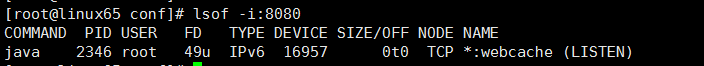
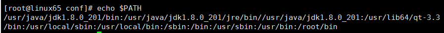
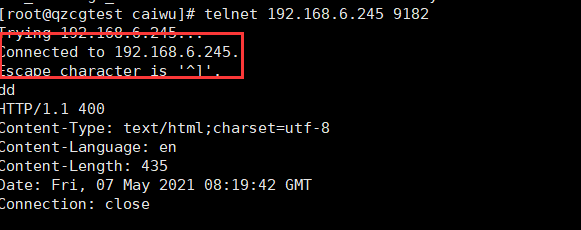

1. ==查看进程是否启动==
    `ps aux | grep tomcat `
    ==推荐==：`ps -ef | grep tomcat`

2. ==查看端口方式==（杀进程）
    `netstat -apn | grep 8080`（Linux）
    `netstat -ano | findstr 80`（windows）
    * `taskkill /pid 4136 -t -f` （window杀进程）
3. ==查看服务cpu利用==
    `top`

4. ==查看服务对应端口==
    `netstat -nlp`

5. ==查看运行内存（Memory）信息==
    `free -m`

6. ==查看实时文件内容，用于查看日志==
    `tail -f （filename）`

7. ==在linux中，& 和 && , | 和 || 介绍如下==
    `&` : 表示任务在后台执行，如要在后台运行redis-server,则有? redis-server
    `&&` : 表示前一条命令执行成功时，才执行后一条命令 ，如 echo '1‘ && echo '2'
    `| `: 表示管道，上一条命令的输出，作为下一条命令参数，如 echo 'yes' | wc -l
    `||` : 表示上一条命令执行失败后，才执行下一条命令，如 cat nofile || echo "fail"

8. ==显示当前位置==
    `pwd`

9. ==管道命令==
    `| ` ：将前一个命令的输出作为本次目录的输入
10. ==杀死进程==
     `kill -9 pid`

11. ==source filename与 sh filename 及./filename执行脚本的区别==
     1. 当shell脚本具有可执行权限时，用`sh filename`与`./filename`执行脚本是没有区别得。`./filename`是因为当前目录没有在PATH中，所有”`.`”是用来表示当前目录的。
     2. `sh filename `重新建立一个子shell，在子shell中执行脚本里面的语句，该子shell继承父shell的环境变量，但子shell新建的、改变的变量不会被带回父shell，除非使用export。
     3. `source filename`：这个命令其实只是简单地读取脚本里面的语句依次在当前shell里面执行，没有建立新的子shell。那么脚本里面所有新建、改变变量的语句都会保存在当前shell里面。

     * `source fileName `重新读取`fileName`的配置信息（`source /etc/profile`）

12. ==查看指定端口的进程pid==
     `lsof -i:8080`
     

13. ==查看Linux环境变量PATH的值==
     `echo $PATH`
     

14. ==ping端口==
     `telnet 192.168.6.245 9182`
     

15. ==查看磁盘空间==
     1. 查看磁盘占用大小
         `df -hl` 查看磁盘剩余空间
         `df -h` 查看每个根路径的分区大小
     2. 查看分区和磁盘
         `lsblk`
     3. 查看分区情况
         `fdisk -l`
