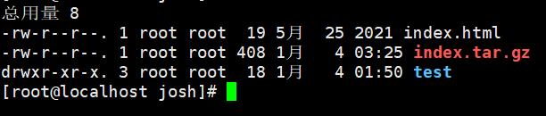
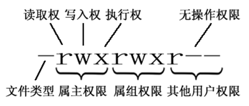

#### 一、权限内容解析

1. 文件类型
    `d`：代表目录
    `-`：代表文件
    `l`：代表链接（window的快捷方式）

2. 读写执行权限
    1. 属主权限
    2. 属组权限
    3. 其他用户权限

3. 读写执行含义
    1. `r`：可读，数字为4标识
    2. `w`：可写，数字为2标识
    3. `x`：可执行，数字为1标识

#### 二、修改权限命令：==chmod==

1. 方式一：
    `chmod u=rwx,g=rw,o=r aaa.txt`

2. 方式二（推荐）：
    ==chmod 764 aaa.txt==
    ==chmod -R 文件夹或者文件(递归授权)==
